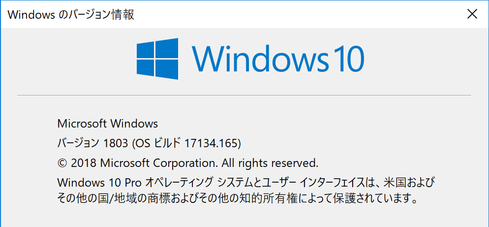
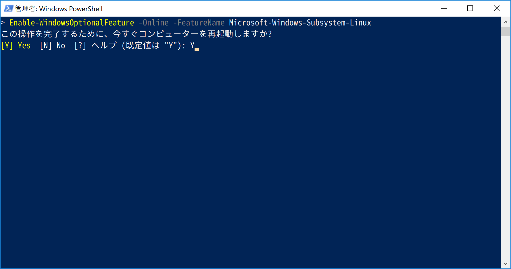
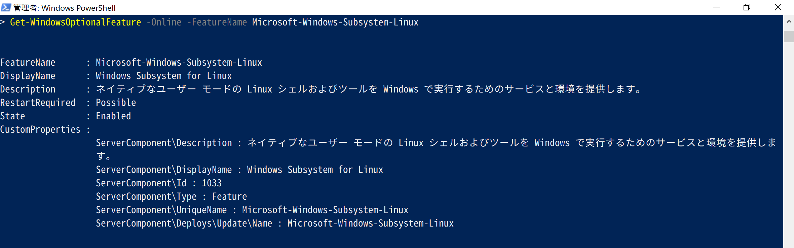
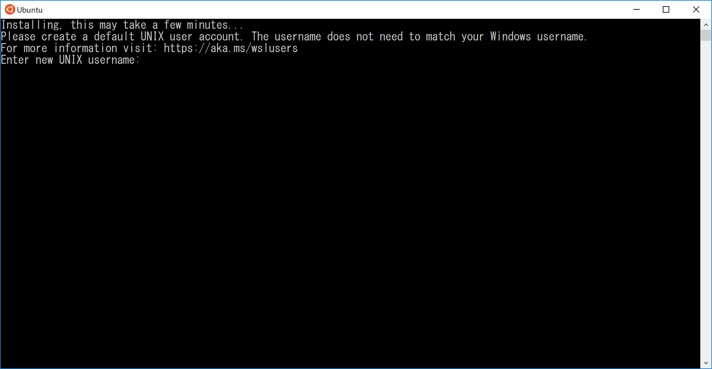
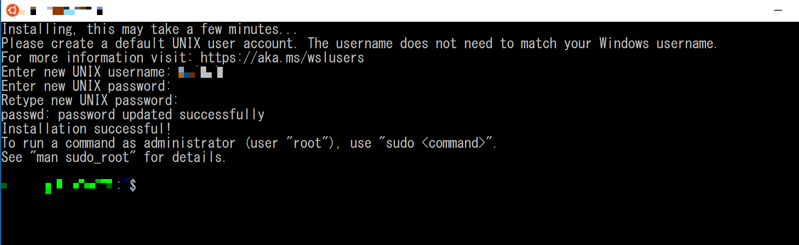
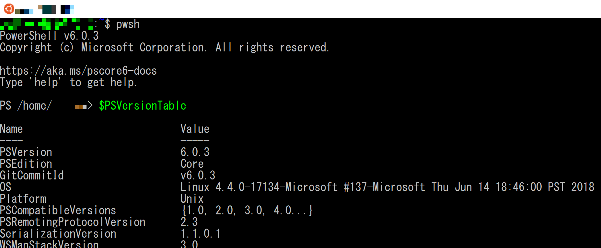
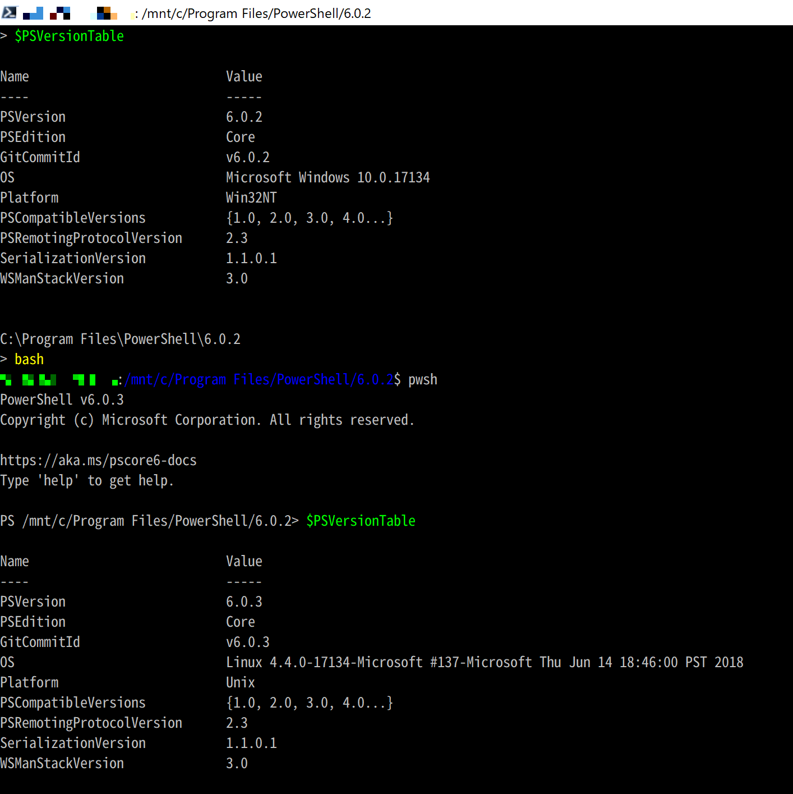

# 🔰Windows Subsystem for Linuxをさわってみる

Windows10に追加されたWindowsとLinuxの仲立ちを行うサブシステム。
Windows Subsystem for Linux Documentationを使いUbuntu 16.04な環境をさわってみたいと思います。

## 🔰ドキュメント

MS DocsにWindows Subsystem for Linuxの資料があるのでこれを参照しながら作業を行う。

[MS Docs - Windows Subsystem for Linux Documentation](https://docs.microsoft.com/en-us/windows/wsl/about)

## 🔰今回試すWindows環境



## 🔰インストール作業

[MS Docs - Windows 10 Installation Guide](https://docs.microsoft.com/en-us/windows/wsl/install-win10)

上記ページを参考に作業を行う。

まずはWindowsの機能の有効化でWindows Subsystem for Linuxが無効になっているので、これを有効化する。

管理者で下記コマンドを実行して再起動します。

```Powershell
Enable-WindowsOptionalFeature -Online -FeatureName Microsoft-Windows-Subsystem-Linux
```



再起動後、管理者で一応設定が有効になっていることを確認します。

```Powershell
Get-WindowsOptionalFeature -Online -FeatureName Microsoft-Windows-Subsystem-Linux
```



これでWHLを利用するための下準備が整ったのでディストリビューションをインストールして行きます。

ドキュメントを参照すると、Storeからインストールしたり、コマンドラインからインストールしたり方法は色々あるようですが。
とりあえず一番簡単そうなStoreからインストールして見ます。

[Microsoft Store - WindowsでLinuxを実行する](https://aka.ms/wslstore)

上記のURLから今回はUbuntuを選択してインストールします。


インストールが完了したら、起動してみます。


コンソールが起動します。

しばらくまつと、新規に作成するユーザ名やパスワードの入力を要求されるで適当に入力します。



さっくりとUbuntuが起動しました。



バージョンを確認してみる。


とりあえず`sudo apt update`と`sudo apt upgrade`してみる。

```sh
sudo apt update
sudo apt upgrade
```

色々と更新されます。

せっかくなのでなんとなくPowershell Coreをインストールしてみる。

[Powershell Core install Ubuntu 16.04](https://docs.microsoft.com/ja-jp/powershell/scripting/setup/installing-powershell-core-on-linux?view=powershell-6#ubuntu-1604)

```sh
# Import the public repository GPG keys
curl https://packages.microsoft.com/keys/microsoft.asc | sudo apt-key add -

# Register the Microsoft Ubuntu repository
sudo curl -o /etc/apt/sources.list.d/microsoft.list https://packages.microsoft.com/config/ubuntu/16.04/prod.list

# Update the list of products
sudo apt-get update

# Install PowerShell
sudo apt-get install -y powershell

# Start PowerShell
pwsh
```

Windows10のWSHのUbuntu16.04のPowershellCoreを起動しました！



なんとなくWindowsのPowershell CoreのコンソールでubuntuにはいってUbuntuのPowershell Coreを起動してバージョンを確認してみる！



🔰 総評

とっても簡単にUbuntu環境に入ることができました。